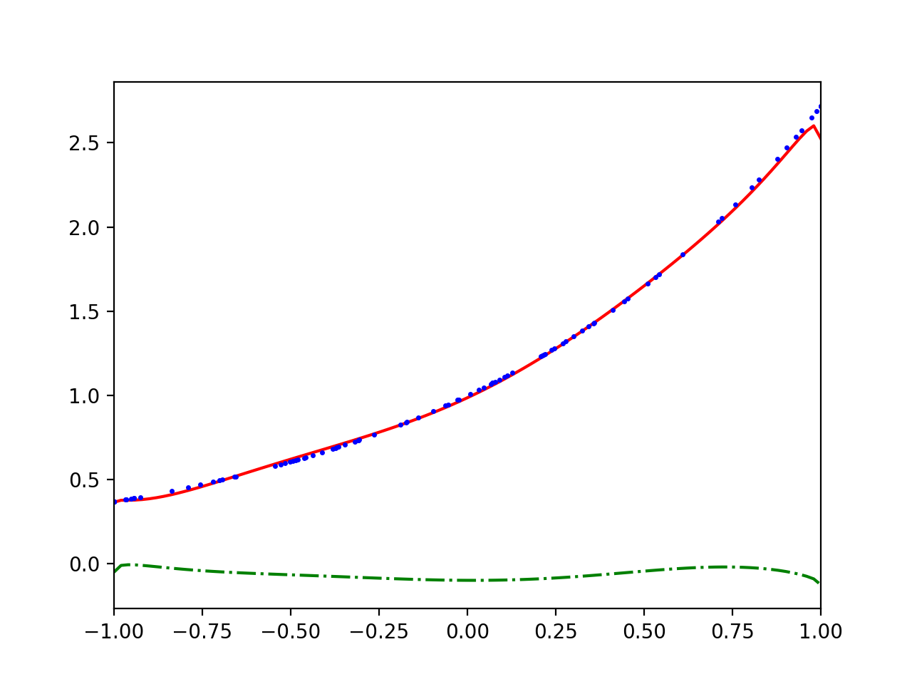
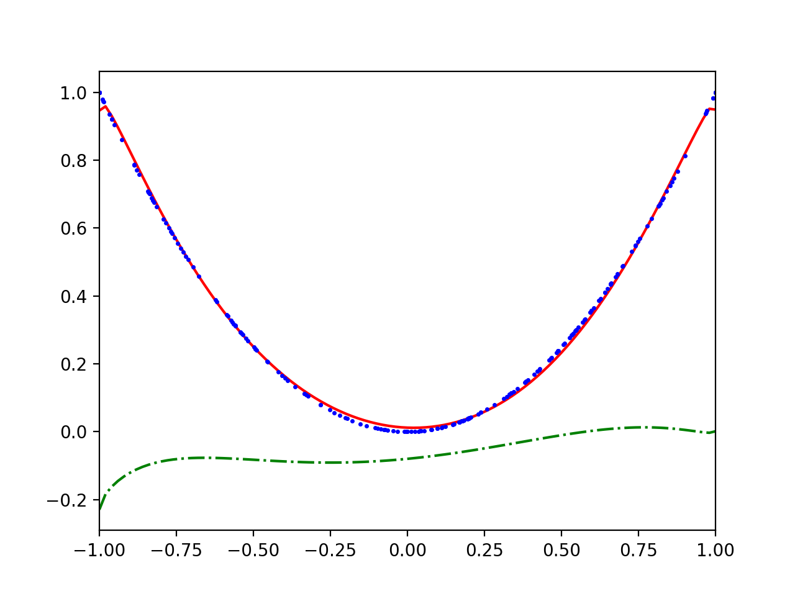
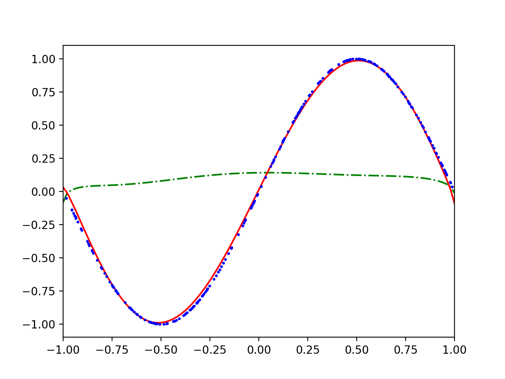

# Simple Quantum Circuit Learning Implementation

A simple one-dimensional implementation of the approach presented by Kosuke Mitarai, Makoto Negoro, Masahiro Kitagawa and Keisuke Fujii in their paper called Quantum Circuit Learning (arXiv:1803.00745). 

In summary their idea consists of a quantum circuit that alternates between full time evolutions of the transverse Ising Hamiltonian 

with randomly initialized parameters and a fixed evolution time, and steps of single-qubit gates on every qubit. The single-qubit gates are generated by angles which are later optimized, while the Ising propagators introduce entanglement. The Z expectation value of the first qubit is taken as the output of the model. The input domain is [-1,1] and mapped onto the qubit states as

The gradient of the Z expectation value with respect to the single-qubit angles is obtained through specific observables and is best read about in the paper itself. 

The implementation is minimal in that it uses the mean square error as the objective function, utilizes online stochastic gradient descent and is written only in numpy (except for the scipy matrix exponential). 

